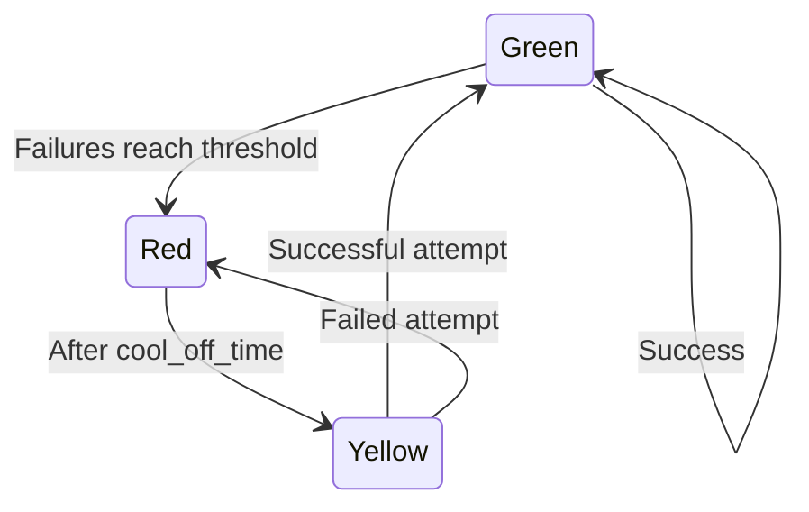

# [Stoplight][]

[![Version badge][]][version]
[![Build badge][]][build]
[![Coverage badge][]][coverage]
[![Climate badge][]][climate]

Stoplight is traffic control for code. It's an implementation of the circuit breaker pattern in Ruby.

---

:warning:️ You're currently browsing the documentation for Stoplight 4.x. If you're looking for
the documentation of the previous version 3.x, you can find it [here](https://github.com/bolshakov/stoplight/tree/release/v3.x).

Stoplight helps your application gracefully handle failures in external dependencies
(like flaky databases, unreliable APIs, or spotty web services). By wrapping these unreliable 
calls, Stoplight prevents cascading failures from affecting your entire application.

**The best part?** Stoplight works with zero configuration out of the box, while offering deep customization when you 
need it.

Check out [stoplight-admin][] for a web UI to control your stoplights.

## Installation

Add it to your Gemfile:

```ruby
gem 'stoplight'
```

Or install it manually:

```sh
$ gem install stoplight
```

Stoplight uses [Semantic Versioning][]. Check out [the change log][] for a detailed list of changes.

## Core Concepts

Stoplight operates like a traffic light with three states:



- **Green**: Normal operation. Code runs as expected. (Circuit closed)
- **Red**: Failure state. Fast-fails without running the code. (Circuit open)
- **Yellow**: Recovery state. Allows a test execution to see if the problem is resolved. (Circuit half-open)

Stoplight's behavior is controlled by three primary parameters:

1. **Threshold** (default: `3`): Number of failures required to transition from green to red.
2. **Cool Off Time** (default: `60` seconds): Time to wait in the red state before transitioning to yellow.
3. **Window Size** (default: `nil`): Time window in which failures are counted toward the threshold. By default, all failures are counted.

## Basic Usage

Stoplight works right out of the box with sensible defaults:

```ruby
# Create a stoplight with default settings
light = Stoplight("Payment Service")

# Use it to wrap code that might fail
result = light.run { payment_gateway.process(order) }
```

When everything works, the light stays green and your code runs normally. If the code fails repeatedly, the 
light turns red and raises a `Stoplight::Error::RedLight` exception to prevent further calls.

```ruby
light = Stoplight("Example")
light.run { 1 / 0 } #=> raises ZeroDivisionError: divided by 0
light.run { 1 / 0 } #=> raises ZeroDivisionError: divided by 0
light.run { 1 / 0 } #=> raises ZeroDivisionError: divided by 0
```

After the last failure, the light turns red. The next call will raise a `Stoplight::Error::RedLight` exception without
executing the block:

```ruby
light.run { 1 / 0 } #=> raises Stoplight::Error::RedLight: example-zero
light.color # => "red"
```

After one minute, the light transitions to yellow, allowing a test execution:

```ruby
# Wait for the cool off time
sleep 60
light.run { 1 / 1 } #=> 1
```

If the test probe succeeds, the light turns green again. If it fails, the light turns red again.

```ruby
light.color #=> "green"
```

### Using Fallbacks

Provide fallbacks to gracefully handle failures:

```ruby
fallback = ->(error) { error ? "Failed: #{error.message}" : "Service unavailable" }

light = Stoplight('example-fallback')
result = light.run(fallback) { external_service.call }
```

If the light is green but the call fails, the fallback receives the `error`. If the light is red, the fallback 
receives `nil`. In both cases, the return value of the fallback becomes the return value of the `run` method.

## Admin Panel

Stoplight goes with a built-in Admin Panel that can track all active Lights and manually lock them in the desired state (`Green` or `Red`). Locking lights in certain states might be helpful in scenarios like E2E testing.

To add Admin Panel to your Rails project, add this configuration to your `config/routes.rb` file.

```ruby
Rails.application.routes.draw do
  # ...

  mount Stoplight::Admin => '/stoplights'

  # ...
end
```

**IMPORTANT:** Stoplight Admin Panel requires you to have `sinatra` and `sinatra-contrib` gems installed. You can either add them to your Gemfile:

```ruby
gem "sinatra", require: false
gem "sinatra-contrib", require: false
```

Or install it manually:
```ruby
gem install sinatra
gem install sinatra-contrib
```

### Standalone Admin Panel Setup

It is possible to run the Admin Panel separately from your application using the `stoplight-admin:<release-version>` docker image.

```shell
docker run --net=host stoplight-admin:v5
```

**IMPORTANT:** Standalone Admin Panel should use the same Redis your application uses. To achieve this, set the `REDIS_URL` ENV variable via `-e REDIS_URL=<url-to-your-redis-servier>.` E.g.:

```shell
docker run -e REDIS_URL=redis://localhost:6378  --net=host stoplight-admin:v5
```


## Configuration 

### Global Configuration

Stoplight allows you to set default values for all lights in your application:

```ruby
Stoplight.configure do |config|
  # Set default behavior for all stoplights
  config.threshold = 5
  config.cool_off_time = 30
  config.window_size = 60
  
  # Set up default data store and notifiers
  config.data_store = Stoplight::DataStore::Redis.new(redis)
  config.notifiers = [Stoplight::Notifier::Logger.new(Rails.logger)]
  
  # Configure error handling defaults
  config.tracked_errors = [StandardError, CustomError]
  config.skipped_errors = [ActiveRecord::RecordNotFound]
end
```

### Creating Stoplights

The simplest way to create a stoplight is with a name:

```ruby
light = Stoplight("Payment Service")
```

You can also provide settings during creation:

```ruby
data_store = Stoplight::DataStore::Redis.new(Redis.new)

light = Stoplight("Payment Service", 
  threshold: 5,                           # 5 failures before turning red
  cool_off_time: 60,                      # Wait 60 seconds before attempting recovery
  window_size: 300,                       # Only count failures in the last five minutes
  data_store: data_store,                 # Use Redis for persistence
  tracked_errors: [TimeoutError],         # Only count TimeoutError
  skipped_errors: [ValidationError]       # Ignore ValidationError
)
```

### Modifying Stoplights

You can create specialized versions of existing stoplights:

```ruby
# Base configuration for API calls
base_api = Stoplight("Service API")

# Create specialized version for the users endpoint
users_api = base_api.with(
  tracked_errors: [TimeoutError]          # Only track timeouts
)
```

The `#with` method creates a new stoplight instance without modifying the original, making it ideal for creating 
specialized stoplights from a common configuration.

## Error Handling

By default, Stoplight tracks all `StandardError` exceptions.
Note: System-level exceptions (e.g., `NoMemoryError`, `SignalException`) are not tracked, as they are not subclasses of `StandardError`.

### Custom Error Configuration

Control which errors affect your stoplight state. Skip specific errors (will not count toward failure threshold)

```ruby
light = Stoplight("Example API", skipped_errors: [ActiveRecord::RecordNotFound, ValidationError])
```

Only track specific errors (only these count toward failure threshold)

```ruby
light = Stoplight("Example API", tracked_errors: [NetworkError, Timeout::Error])
```

When both methods are used, `skipped_errors` takes precedence over `tracked_errors`.

## Advanced Configuration

### Data Store

Stoplight uses an in-memory data store out of the box:

```ruby
require "stoplight"
Stoplight::Default::DATA_STORE
# => #<Stoplight::DataStore::Memory:...>
```

For production environments, you'll likely want to use a persistent data store. Currently, [Redis] is the supported option:

```ruby
# Configure Redis as the data store
require "redis"
redis = Redis.new
data_store = Stoplight::DataStore::Redis.new(redis)

Stoplight.configure do |config|
  config.data_store = data_store
end
```

#### Connection Pooling with Redis

For high-traffic applications or when you want to control a number of opened connections to Redis: 

```ruby
require "connection_pool"
pool = ConnectionPool.new(size: 5, timeout: 3) { Redis.new }
data_store = Stoplight::DataStore::Redis.new(pool)

Stoplight.configure do |config|
  config.data_store = data_store
end
```

### Notifiers

Stoplight notifies when lights change state. Configure how these notifications are delivered:

```ruby
# Log to a specific logger
logger = Logger.new("stoplight.log")
notifier = Stoplight::Notifier::Logger.new(logger)

# Configure globally
Stoplight.configure do |config|
  config.notifiers = [notifier]
end
```

In this example, when Stoplight fails three times in a row, it will log the error to `stoplight.log`:

```log
W, [2025-04-16T09:18:46.778447 #44233]  WARN -- : Switching test-light from green to red because RuntimeError bang!
```

By default, Stoplight logs state transitions to STDERR.

#### Community-supported Notifiers

* [stoplight-sentry]
* [stoplight-honeybadger]

Pull requests to update this section are welcome. If you want to implement your own notifier, refer to
the [notifier interface documentation] for detailed instructions. Pull requests to update this section are welcome.

### Error Notifiers

Stoplight is built for resilience. If the Redis data store fails, Stoplight automatically falls back to the in-memory 
data store. To get notified about such errors, you can configure an error notifier:

```ruby
Stoplight.configure do |config|
  config.error_notifier = ->(error) { Bugsnag.notify(error) }
end
```

### Locking

Sometimes you need to override Stoplight's automatic behavior. Locking allows you to manually control the state of 
a stoplight, which is useful for:

* **Maintenance periods**: Lock to red when a service is known to be unavailable
* **Emergency overrides**: Lock to green to force traffic through during critical operations
* **Testing scenarios**: Control circuit state without waiting for failures
* **Gradual rollouts**: Manually control which stoplights are active during deployments

```ruby
# Force a stoplight to red state (fail all requests)
# Useful during planned maintenance or when you know a service is down
light.lock(Stoplight::Color::RED)

# Force a stoplight to green state (allow all requests)
# Useful for critical operations that must attempt to proceed
light.lock(Stoplight::Color::GREEN)

# Return to normal operation (automatic state transitions)
light.unlock
```

## Rails Integration

Wrap controller actions with minimal effort:

```ruby
class ApplicationController < ActionController::Base
  around_action :stoplight

  private

  def stoplight(&block)
    Stoplight("#{params[:controller]}##{params[:action]}")
      .run(-> { render(nothing: true, status: :service_unavailable) }, &block)
  end
end
```

Configure Stoplight in an initializer:

```ruby
# config/initializers/stoplight.rb
require "stoplight"
Stoplight.configure do |config|
  config.data_store = Stoplight::DataStore::Redis.new(Redis.new)
  config.notifiers += [Stoplight::Notifier::Logger.new(Rails.logger)]
end
```

## Testing

Tips for working with Stoplight in test environments:

1. Silence notifications in tests
```ruby
Stoplight.configure do |config|
  config.error_notifier = -> _ {}
  config.notifiers = []
end
```

2. Reset data store between tests
```ruby
before(:each) do
  Stoplight.reset_config!
  Stoplight.configure do |config|
    config.data_store = Stoplight::DataStore::Memory.new
  end
end
```

3. Or use unique names for test Stoplights to avoid persistence between tests:
```ruby
stoplight = Stoplight("test-#{rand}")
```

## Maintenance Policy

Stoplight supports the latest three minor versions of Ruby, which currently are: `3.2.x`, `3.3.x`, and `3.4.x`. Changing
the minimum supported Ruby version is not considered a breaking change. We support the current stable Redis 
version (`7.4.x`) and the latest release of the previous major version (`6.2.x`)

## Credits

Stoplight was originally created by [camdez][] and [tfausak][]. It is currently maintained by [bolshakov][] and
[Lokideos][]. You can find a [complete list of contributors][] on GitHub. The project was inspired by Martin 
Fowler’s [CircuitBreaker][] article.

[Stoplight]: https://github.com/bolshakov/stoplight
[Version badge]: https://img.shields.io/gem/v/stoplight.svg?label=version
[version]: https://rubygems.org/gems/stoplight
[Build badge]: https://github.com/bolshakov/stoplight/workflows/Specs/badge.svg
[build]: https://github.com/bolshakov/stoplight/actions?query=branch%3Amaster
[Coverage badge]: https://img.shields.io/coveralls/bolshakov/stoplight/master.svg?label=coverage
[coverage]: https://coveralls.io/r/bolshakov/stoplight
[Climate badge]: https://api.codeclimate.com/v1/badges/3451c2d281ffa345441a/maintainability
[climate]: https://codeclimate.com/github/bolshakov/stoplight
[stoplight-admin]: https://github.com/bolshakov/stoplight-admin
[Semantic Versioning]: http://semver.org/spec/v2.0.0.html
[the change log]: CHANGELOG.md
[stoplight-sentry]: https://github.com/bolshakov/stoplight-sentry
[stoplight-honeybadger]: https://github.com/qoqa/stoplight-honeybadger
[notifier interface documentation]: https://github.com/bolshakov/stoplight/blob/master/lib/stoplight/notifier/generic.rb
[camdez]: https://github.com/camdez
[tfausak]: https://github.com/tfausak
[bolshakov]: https://github.com/bolshakov
[Lokideos]: https://github.com/Lokideos
[complete list of contributors]: https://github.com/bolshakov/stoplight/graphs/contributors
[CircuitBreaker]: http://martinfowler.com/bliki/CircuitBreaker.html
[Redis]: https://redis.io/
