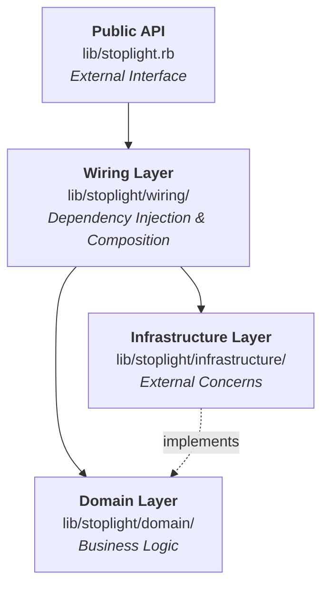
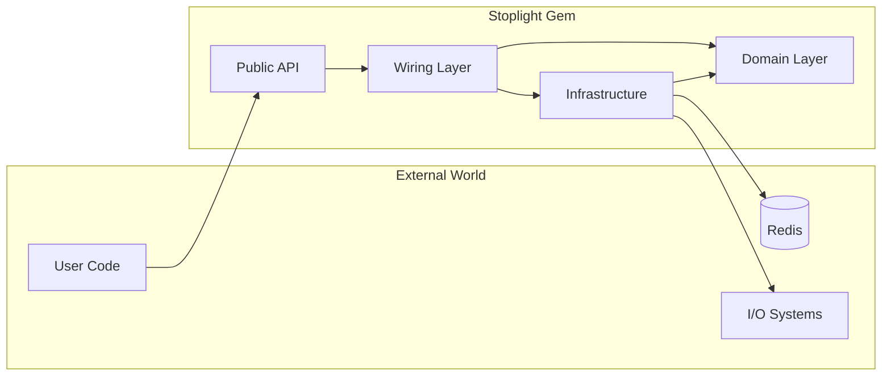
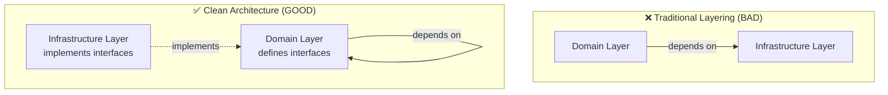
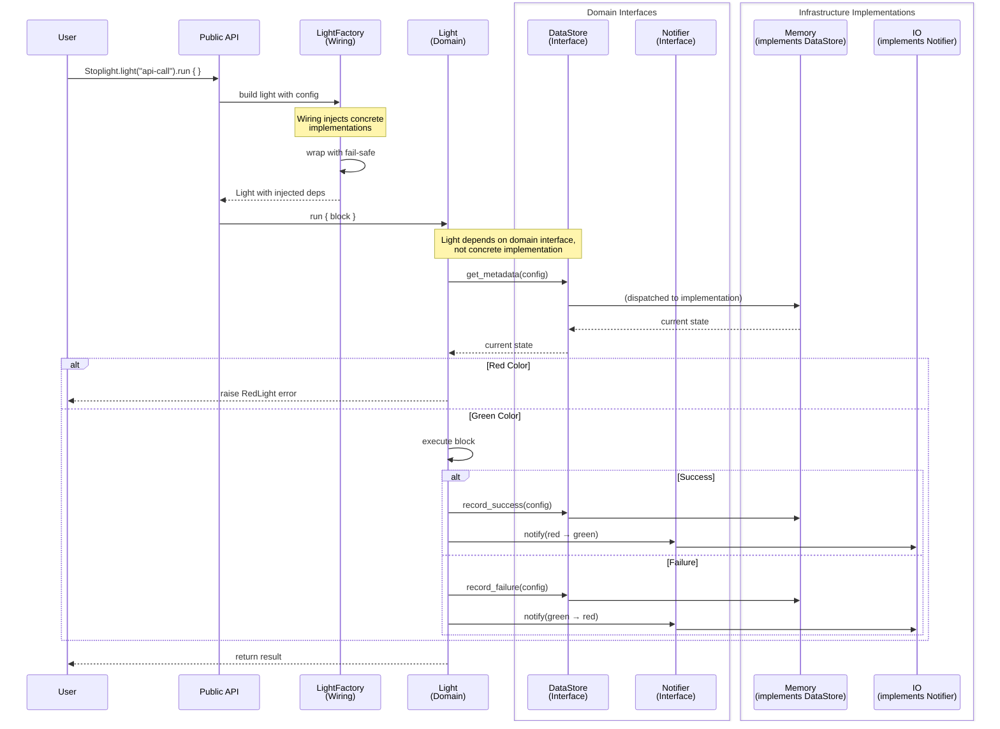
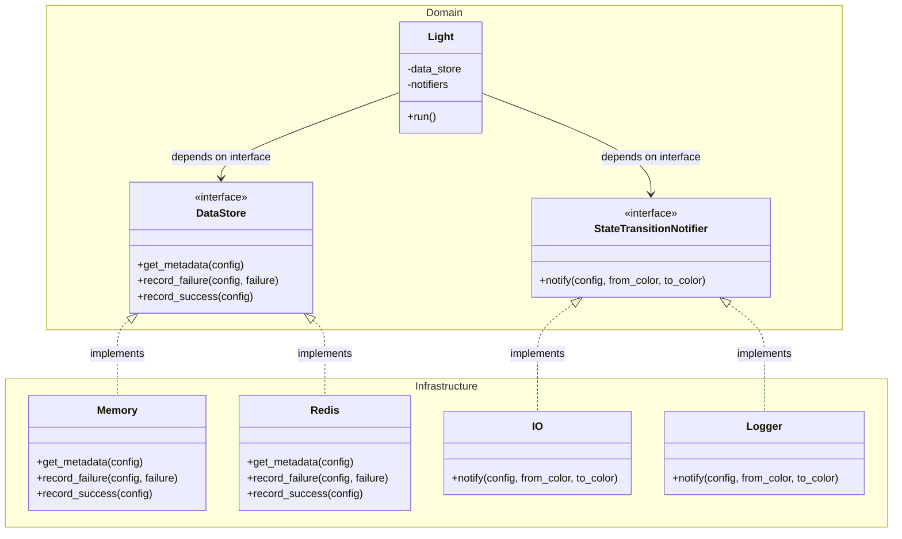

## Architecture Overview

Stoplight follows **Clean Architecture** principles with clear separation of concerns across four main layers:



### Key Principles

1. **Domain Layer** contains pure business logic with no external dependencies
2. **Infrastructure Layer** handles external concerns (I/O, storage, notifications)
3. **Wiring Layer** composes dependencies and provides fail-safe wrappers

### Dependency Flow

Dependencies always flow inward toward the domain:



The domain never depends on infrastructure. Infrastructure implements domain interfaces.

### Understanding Dependency Inversion

This architecture follows the **Dependency Inversion Principle**:



Here is a real world example:

1. Domain defines interfaces (abstract contracts):
```ruby
# lib/stoplight/domain/data_store.rb
module Stoplight::Domain
 class DataStore  # This is the interface
   def get_metadata(config)
     raise NotImplementedError
   end
 end
end
```

2. Infrastructure implements interfaces:
```ruby
# lib/stoplight/infrastructure/data_store/memory.rb
module Stoplight::Infrastructure::DataStore
 class Memory < Stoplight::Domain::DataStore
   def get_metadata(config)
     # Concrete implementation
   end
 end
end
```

3. Domain code depends only on domain interfaces:
   ```ruby
   # lib/stoplight/domain/light.rb
   module Stoplight::Domain
     class Light
       # @param data_store [Stoplight::Domain::DataStore]
       def initialize(data_store:)  # Expects domain interface
         @data_store = data_store
       end
       
       def run
         metadata = @data_store.get_metadata(config)  # Calls interface
       end
     end
   end
   ```

4. Wiring layer injects implementations:
```ruby
# lib/stoplight/wiring/light_factory.rb
concrete_store = Infrastructure::DataStore::Memory.new
light = Domain::Light.new(data_store: concrete_store)
```

**Result:** Domain is pure and testable, infrastructure is swappable.

### Request Flow Example

Here's how a Stoplight call flows through the layers. Note that `Light` (domain) only depends on **interfaces** defined
in the domain layer:



As you can see:
- `Light` (domain) depends only on `DataStore` and `Notifier` **interfaces** (also in domain)
- `Memory` and `IO` (infrastructure) implement these domain interfaces
- The wiring layer injects concrete implementations at runtime
- This is **Dependency Inversion**: depend on abstractions, not concrete implementations

## Code Organization

### Directory Structure

```
lib/stoplight/
├── domain/                          # 🟢 Business logic & core abstractions
│   ├── config.rb                    # Circuit breaker configuration
│   ├── light.rb                     # Core circuit breaker implementation
│   ├── metadata.rb                  # State tracking data
│   ├── data_store.rb                # Abstract data store interface
│   ├── state_transition_notifier.rb # Abstract notifier interface
│   ├── traffic_control/             # Traffic control strategies
│   │   ├── consecutive_errors.rb
│   │   └── error_rate.rb
│   └── traffic_recovery/            # Recovery strategies
│       └── consecutive_successes.rb
│
├── infrastructure/                  # 🔴 External dependencies & adapters
│   ├── data_store/                  # Concrete data store implementations
│   │   ├── memory.rb
│   │   └── redis.rb
│   └── notifier/                    # Concrete notifier implementations
│       ├── io.rb
│       └── honeybadger.rb
│
├── wiring/                          # 🟡 Dependency injection & composition
│   ├── container.rb                 # DI container
│   ├── light_factory.rb             # Factory for creating lights
│   ├── fail_safe_data_store.rb      # Fail-safe wrapper
│   └── fail_safe_notifier.rb        # Fail-safe wrapper
│
└── admin/                           # Admin UI

spec/
├── unit/                            # Fast, isolated unit tests
│   ├── stoplight/domain/
│   ├── stoplight/infrastructure/
│   └── stoplight/wiring/
│
└── integration/                     # Integration tests
    └── features/
```

### Layer Responsibilities

#### Domain Layer (`lib/stoplight/domain/`)

**Purpose:** Pure business logic with zero external dependencies

**Contains:**
- Core circuit breaker logic (`Light`)
- Configuration value objects (`Config`)
- State management (`Metadata`)
- Abstract interfaces (`DataStore`, `StateTransitionNotifier`)
- Traffic Control strategies
- Traffic Recovery strategies

**Rules:**
- NO external gem dependencies (except standard library)
- NO I/O operations
- Only depends on other domain objects
- Interfaces define contracts for infrastructure

Example:

```ruby
module Stoplight
  module Domain
    # Abstract interface - domain defines the contract
    class DataStore
      def get_metadata(config)
        raise NotImplementedError
      end

      def record_failure(config, failure)
        raise NotImplementedError
      end
    end
  end
end
```

#### Infrastructure Layer (`lib/stoplight/infrastructure/`)

**Purpose:** Implementations that interact with external systems

**Contains:**
- Concrete data store implementations (Memory, Redis)
- Concrete notifier implementations (IO, Logger, etc.)
- Any code that does I/O or depends on external gems

**Rules:**
- Implements domain interfaces
- Can depend on external gems
- Can perform I/O operations
- Should not contain business logic
- Must be swappable without affecting domain

Example:

```ruby
module Stoplight
  module Infrastructure
    module DataStore
      # Concrete implementation using in-memory storage
      class Memory < Domain::DataStore
        def get_metadata(config)
          # Implementation details...
        end
      end
    end
  end
end
```

#### Wiring Layer (`lib/stoplight/wiring/`)

**Purpose:** Dependency injection, composition, and fault-tolerance patterns

**Contains:**
- Dependency injection container
- Factory classes for creating configured objects
- Fail-safe wrappers for resilience
- Public API composition

**Rules:**
- Composes domain and infrastructure components
- Provides fail-safe wrappers
- Handles configuration and defaults
- Should not contain business logic
- Bridges between layers

Example:
```ruby
module Stoplight
  module Wiring
    # Compose dependencies
    class LightFactory
      def build_with(name:, data_store:, notifiers:, **config)
        safe_data_store = FailSafeDataStore.wrap(data_store)
        safe_notifiers = notifiers.map { FailSafeNotifier.wrap(_1) }
        
        # Build domain object
        Domain::Light.new(
          config: Domain::Config.new(name:, **config),
          data_store: safe_data_store,
          notifiers: safe_notifiers
        )
      end
    end
  end
end
```

## Architecture Boundaries

We enforce architecture boundaries using a custom RuboCop cop. This prevents:

- Domain layer from depending on infrastructure
- Infrastructure from containing business logic
- Improper cross-layer dependencies

### Interface Implementation Pattern



Domain defines interfaces, Infrastructure implements them.

### Common Violations

Understanding what breaks clean architecture:

- ❌ Violation 1: Domain directly referencing infrastructure
```ruby
# In lib/stoplight/domain/light.rb - WRONG!
module Stoplight::Domain
  class Light
    def notify_error
      # BAD: Domain knows about concrete infrastructure, does not allow runtime swapping
      Stoplight::Infrastructure::Notifier::IO.new.notify(...)
    end
  end
end
```

- ✅ Correct: Domain depends on domain interface
```ruby
# In lib/stoplight/domain/light.rb - CORRECT
module Stoplight::Domain
  class Light
    def initialize(notifiers:)
      @notifiers = notifiers  # Array of domain interfaces
    end
    
    def notify_error
      # GOOD: Calls through abstraction
      @notifiers.each { |notifier| notifier.notify(...) }
    end
  end
end

# Interface defined in domain
# lib/stoplight/domain/state_transition_notifier.rb
module Stoplight::Domain
  class StateTransitionNotifier
    def notify(config, from_color, to_color)
      raise NotImplementedError
    end
  end
end

# Implementation in infrastructure
# lib/stoplight/infrastructure/notifier/io.rb
module Stoplight::Infrastructure::Notifier
  class IO < Domain::StateTransitionNotifier
    def notify(config, from_color, to_color)
      # Concrete implementation
    end
  end
end
```

- ❌ Violation 2: Domain requiring external gems
```ruby
# In lib/stoplight/domain/light.rb - WRONG!
require 'redis'  # External gem dependency

module Stoplight::Domain
  class Light
    def store_state
      Redis.new.set(...)  # BAD: Domain doing I/O
    end
  end
end
```

- ✅ Correct: Infrastructure handles external dependencies
```ruby
# Domain defines what it needs
# lib/stoplight/domain/light.rb
module Stoplight::Domain
  class Light
    def initialize(data_store:)
      @data_store = data_store  # Domain interface
    end
    
    def store_state
      @data_store.record_success(config)  # Interface call
    end
  end
end

# Infrastructure provides implementation
# lib/stoplight/infrastructure/data_store/redis.rb
require 'redis'  # External gem - OK in infrastructure

module Stoplight::Infrastructure::DataStore
  class Redis < Domain::DataStore
    def record_success(config)
      @redis.set(...)  # I/O operations in infrastructure
    end
  end
end
```

**Remember:** If you see domain code importing external gems or referencing infrastructure namespaces, that's a boundary
violation!
