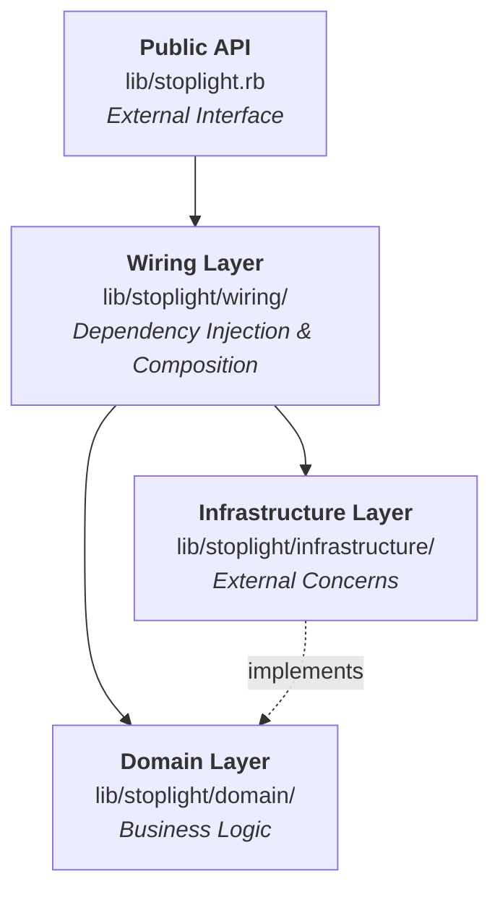
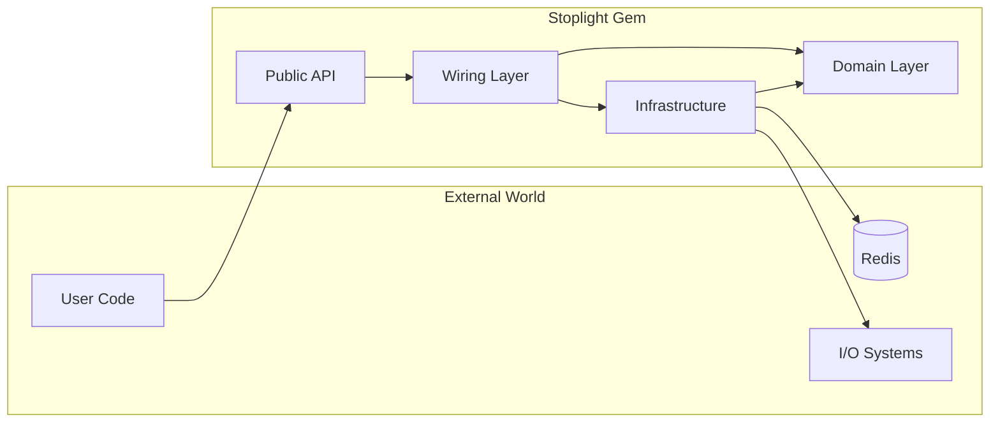
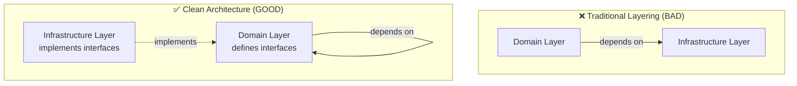
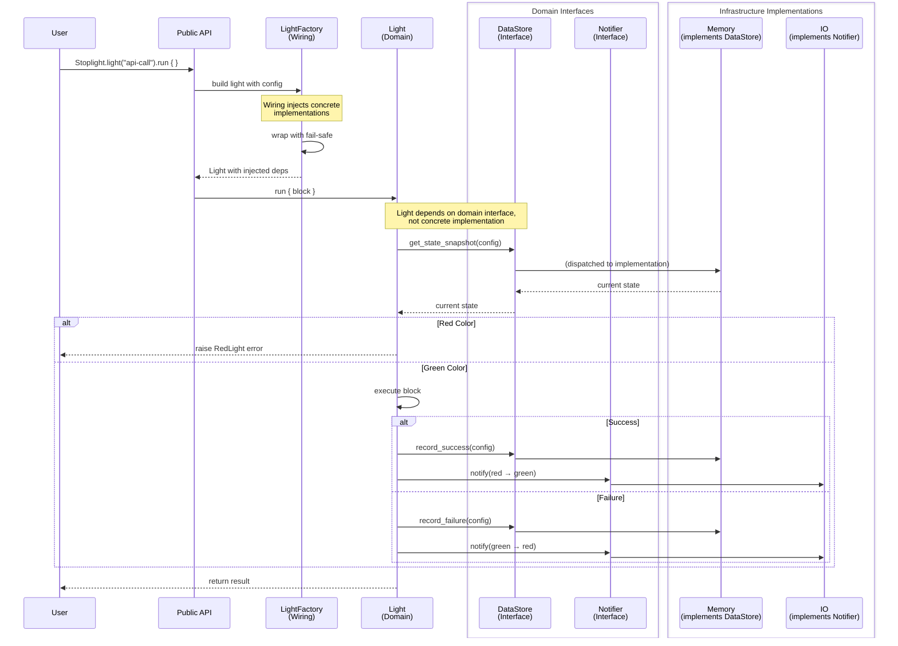
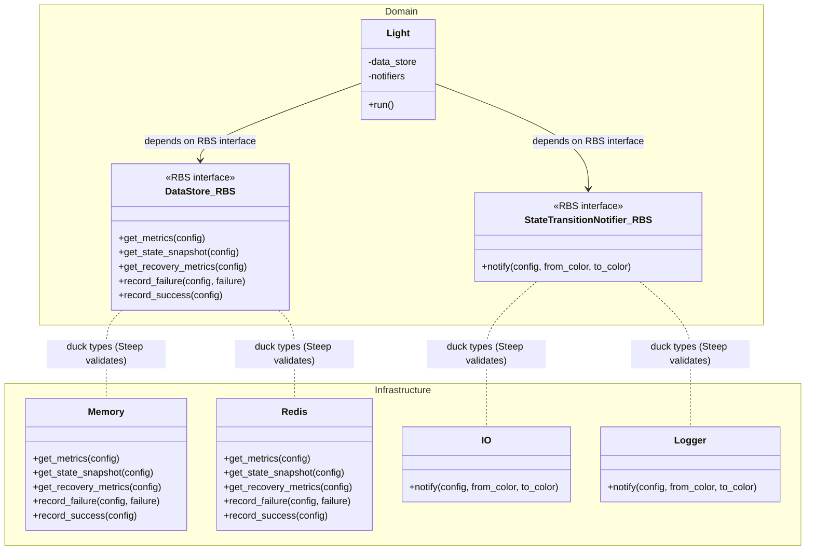

## Architecture Overview

Stoplight follows **Clean Architecture** principles with clear separation of concerns across four main layers:



### Key Principles

1. **Domain Layer** contains pure business logic with no external dependencies
2. **Infrastructure Layer** handles external concerns (I/O, storage, notifications)
3. **Wiring Layer** composes dependencies and provides fail-safe wrappers

### Dependency Flow

Dependencies always flow inward toward the domain:



The domain never depends on infrastructure. Infrastructure implements domain interfaces.

### Understanding Dependency Inversion

This architecture follows the **Dependency Inversion Principle**:



Here is a real world example:

1. Domain defines interfaces using **RBS type signatures**:
```ruby
# sig/_private/stoplight/domain/ports/data_store.rbs
module Stoplight
  module Domain
    interface _DataStore
      def get_metrics: (Config) -> MetricsSnapshot
      def get_state_snapshot: (Config) -> StateSnapshot
      def record_failure: (Config, StandardError exception) -> void
      # ... other methods
    end
  end
end
```

Note: There is **no Ruby base class** in `lib/stoplight/domain/`. Interfaces are pure type definitions.

2. Infrastructure implements interfaces via **duck typing**:
```ruby
# lib/stoplight/infrastructure/memory/data_store.rb
module Stoplight::Infrastructure::Memory
  # No inheritance - satisfies interface through duck typing
  class DataStore
    # @param config [Stoplight::Domain::Config]
    # @return [Stoplight::Domain::MetricsSnapshot]
    def get_metrics(config)
      # Concrete implementation
    end

    # @param config [Stoplight::Domain::Config]
    # @return [Stoplight::Domain::StateSnapshot]
    def get_state_snapshot(config)
      # Concrete implementation
    end
  end
end
```

3. Domain code depends only on **type-checked interfaces**:
```ruby
# lib/stoplight/domain/light.rb
module Stoplight::Domain
  class Light
    # @param data_store [Stoplight::Domain::_DataStore]
    def initialize(data_store:)  # Expects interface (duck-typed)
      @data_store = data_store
    end

    def run
      state = @data_store.get_state_snapshot(config)  # Calls interface
    end
  end
end
```

4. Wiring layer injects implementations:
```ruby
# lib/stoplight/wiring/light_factory.rb
concrete_store = Infrastructure::Memory::DataStore.new
light = Domain::Light.new(data_store: concrete_store)
```

**Result:**
- Domain is pure and testable
- Infrastructure is swappable
- Type safety enforced via **RBS + Steep** (static type checker)
- Embraces Ruby's duck typing philosophy

### Request Flow Example

Here's how a Stoplight call flows through the layers. Note that `Light` (domain) only depends on **interfaces** defined
in the domain layer:



As you can see:
- `Light` (domain) depends only on `DataStore` and `Notifier` **interfaces** (also in domain)
- `Memory` and `IO` (infrastructure) implement these domain interfaces
- The wiring layer injects concrete implementations at runtime
- This is **Dependency Inversion**: depend on abstractions, not concrete implementations

## Code Organization

### Directory Structure

```
lib/stoplight/
├── domain/                          # 🟢 Business logic & core abstractions
│   ├── config.rb                    # Circuit breaker configuration
│   ├── light.rb                     # Core circuit breaker implementation
│   ├── state_snapshot.rb            # State tracking data
│   ├── metrics.rb                   # Runtime Metrics
│   ├── data_store.rb                # Abstract data store interface
│   ├── state_transition_notifier.rb # Abstract notifier interface
│   ├── traffic_control/             # Traffic control strategies
│   │   ├── consecutive_errors.rb
│   │   └── error_rate.rb
│   └── traffic_recovery/            # Recovery strategies
│       └── consecutive_successes.rb
│
├── infrastructure/                  # 🔴 External dependencies & adapters
│   ├── data_store/                  # Concrete data store implementations
│   │   ├── memory.rb
│   │   └── redis.rb
│   └── notifier/                    # Concrete notifier implementations
│       ├── io.rb
│       └── honeybadger.rb
│
├── wiring/                          # 🟡 Dependency injection & composition
│   ├── container.rb                 # DI container
│   ├── light_factory.rb             # Factory for creating lights
│   ├── fail_safe_data_store.rb      # Fail-safe wrapper
│   └── fail_safe_notifier.rb        # Fail-safe wrapper
│
└── admin/                           # Admin UI

spec/
├── unit/                            # Fast, isolated unit tests
│   ├── stoplight/domain/
│   ├── stoplight/infrastructure/
│   └── stoplight/wiring/
│
└── integration/                     # Integration tests
    └── features/
```

### Layer Responsibilities

#### Domain Layer (`lib/stoplight/domain/`)

**Purpose:** Pure business logic with zero external dependencies

**Contains:**
- Core circuit breaker logic (`Light`)
- Configuration value objects (`Config`)
- State management (`StateSnapshot`, `MetricsSnapshot`)
- **RBS interface definitions** (in `sig/_private/stoplight/domain/ports/`)
- Traffic Control strategies
- Traffic Recovery strategies

**Rules:**
- NO external gem dependencies (except standard library)
- NO I/O operations
- Only depends on other domain objects
- **NO Ruby abstract base classes** - interfaces are pure RBS type definitions
- Interfaces define contracts for infrastructure via duck typing

Example (RBS interface definition):

```ruby
# sig/_private/stoplight/domain/ports/data_store.rbs
module Stoplight
  module Domain
    # Interface definition (type signature only)
    interface _DataStore
      def get_metrics: (Config) -> MetricsSnapshot
      def record_failure: (Config, StandardError exception) -> void
      def record_success: (Config) -> void
      # ... other methods
    end
  end
end
```

Note: This is an **RBS type definition**, not executable Ruby code. There is no corresponding `.rb` file in `lib/stoplight/domain/`.

#### Infrastructure Layer (`lib/stoplight/infrastructure/`)

**Purpose:** Implementations that interact with external systems

**Contains:**
- Concrete data store implementations (Memory, Redis)
- Concrete notifier implementations (IO, Logger, etc.)
- Any code that does I/O or depends on external gems

**Rules:**
- Implements domain interfaces **via duck typing** (no inheritance)
- Can depend on external gems
- Can perform I/O operations
- Should not contain business logic
- Must be swappable without affecting domain
- Type-checked by Steep to ensure interface compliance

Example:

```ruby
module Stoplight
  module Infrastructure
    module Memory
      # Concrete implementation using in-memory storage
      # Satisfies Domain::_DataStore interface via duck typing
      class DataStore
        # @param config [Stoplight::Domain::Config]
        # @return [Stoplight::Domain::MetricsSnapshot]
        def get_metrics(config)
          # Implementation details...
          Domain::MetricsSnapshot.new(...)
        end

        # @param config [Stoplight::Domain::Config]
        # @param exception [StandardError]
        # @return [void]
        def record_failure(config, exception)
          # Implementation details...
        end
      end
    end
  end
end
```

Note: **No inheritance from domain**. Steep validates that this class satisfies the `_DataStore` interface.

#### Wiring Layer (`lib/stoplight/wiring/`)

**Purpose:** Dependency injection, composition, and fault-tolerance patterns

**Contains:**
- Dependency injection container
- Factory classes for creating configured objects
- Public API composition

**Rules:**
- Composes domain and infrastructure components
- Handles configuration and defaults
- Should not contain business logic
- Bridges between layers

Example:

```ruby

module Stoplight
  module Wiring
    # Compose dependencies
    class LightFactory
      def build_with(name:, data_store:, notifiers:, **config)
        safe_data_store = DataStoreFactory.create(data_store)
        safe_notifiers = notifiers.map { NotifierFactory.create(_1) }

        # Build domain object
        Domain::Light.new(
          config: Domain::Config.new(name:, **config),
          data_store: safe_data_store,
          notifiers: safe_notifiers
        )
      end
    end
  end
end
```

## Architecture Boundaries

We enforce architecture boundaries using a custom RuboCop cop. This prevents:

- Domain layer from depending on infrastructure
- Infrastructure from containing business logic
- Improper cross-layer dependencies

### Interface Implementation Pattern



**Key Differences from Traditional Architecture:**
- Interfaces exist only as **RBS type definitions** (`.rbs` files)
- No Ruby inheritance between domain and infrastructure
- Infrastructure classes satisfy interfaces via **duck typing**
- **Steep** (static type checker) validates interface compliance at development time
- Zero runtime coupling between layers

### Common Violations

Understanding what breaks clean architecture:

#### ❌ Violation 1: Domain directly referencing infrastructure

**WRONG:**
```ruby
# In lib/stoplight/domain/light.rb - BAD!
module Stoplight::Domain
  class Light
    def notify_error
      # BAD: Domain knows about concrete infrastructure
      # This creates coupling and prevents swapping implementations
      Stoplight::Infrastructure::Notifier::IO.new.notify(...)
    end
  end
end
```

**CORRECT:**
```ruby
# In lib/stoplight/domain/light.rb - GOOD!
module Stoplight::Domain
  class Light
    # @param notifiers [Array<Stoplight::Domain::_StateTransitionNotifier>]
    def initialize(notifiers:)
      @notifiers = notifiers  # Array of duck-typed objects
    end

    def notify_error
      # GOOD: Calls through interface (duck-typed)
      @notifiers.each { |notifier| notifier.notify(...) }
    end
  end
end

# Interface defined in RBS (NOT in Ruby)
# sig/_private/stoplight/domain/ports/state_transition_notifier.rbs
module Stoplight::Domain
  interface _StateTransitionNotifier
    def notify: (Config, color from_color, color to_color) -> void
  end
end

# Implementation in infrastructure (duck typing, no inheritance)
# lib/stoplight/infrastructure/notifier/io.rb
module Stoplight::Infrastructure::Notifier
  class IO
    # @param config [Stoplight::Domain::Config]
    # @param from_color [Stoplight::Color::color]
    # @param to_color [Stoplight::Color::color]
    # @return [void]
    def notify(config, from_color, to_color)
      # Concrete implementation
      # Steep validates this matches the interface
    end
  end
end
```

#### ❌ Violation 2: Domain requiring external gems

**WRONG:**
```ruby
# In lib/stoplight/domain/light.rb - BAD!
require 'redis'  # External gem dependency in domain!

module Stoplight::Domain
  class Light
    def store_state
      Redis.new.set(...)  # BAD: Domain doing I/O
    end
  end
end
```

**CORRECT:**
```ruby
# Domain defines what it needs (via RBS interface)
# lib/stoplight/domain/light.rb
module Stoplight::Domain
  class Light
    # @param data_store [Stoplight::Domain::_DataStore]
    def initialize(data_store:)
      @data_store = data_store  # Duck-typed interface
    end

    def store_state
      @data_store.record_success(config)  # Interface call
    end
  end
end

# Interface in RBS
# sig/_private/stoplight/domain/ports/data_store.rbs
module Stoplight::Domain
  interface _DataStore
    def record_success: (Config) -> void
  end
end

# Infrastructure provides implementation
# lib/stoplight/infrastructure/redis/data_store.rb
require 'redis'  # External gem - OK in infrastructure!

module Stoplight::Infrastructure::Redis
  class DataStore
    # @param config [Stoplight::Domain::Config]
    # @return [void]
    def record_success(config)
      @redis.set(...)  # I/O operations in infrastructure
    end
  end
end
```

#### ❌ Violation 3: Creating abstract base classes in domain

**WRONG (old pattern, no longer used):**
```ruby
# lib/stoplight/domain/data_store.rb - DON'T DO THIS!
module Stoplight::Domain
  class DataStore
    def get_metrics(config)
      raise NotImplementedError  # Runtime error, creates coupling
    end
  end
end
```

**CORRECT (current pattern):**
```ruby
# sig/_private/stoplight/domain/ports/data_store.rbs
module Stoplight::Domain
  interface _DataStore  # Type definition, not runtime code
    def get_metrics: (Config) -> MetricsSnapshot
  end
end

# No .rb file needed! Steep validates at development time.
```

**Key Reminders:**
- ✅ Domain interfaces live in `.rbs` files, not `.rb` files
- ✅ Infrastructure uses duck typing (no inheritance)
- ✅ Steep provides compile-time type checking
- ❌ Domain never imports external gems
- ❌ Domain never references infrastructure namespaces
- ❌ No `raise NotImplementedError` patterns
